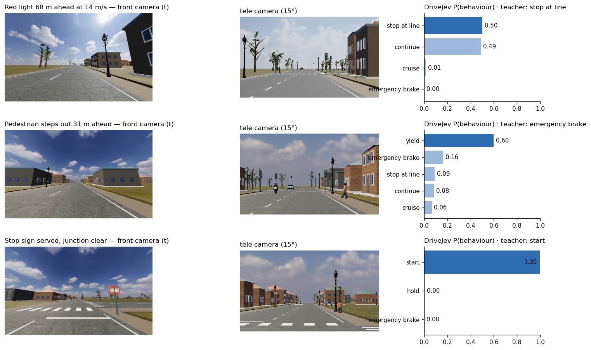
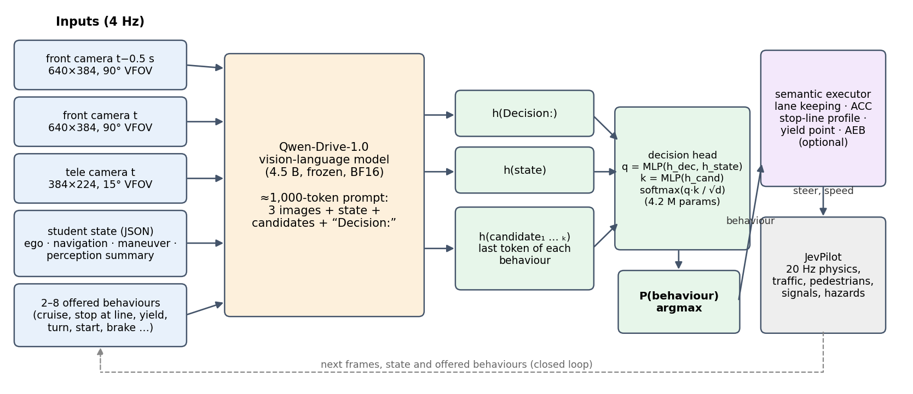
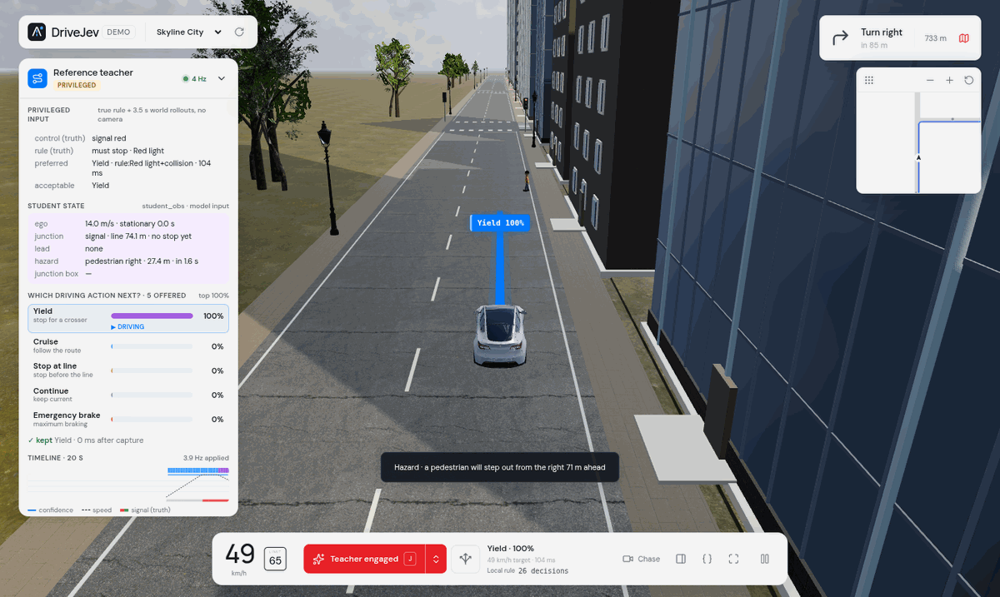

<h1 align="center">DriveJev</h1>

<h3 align="center">A vision-language driving policy that answers “what should the car do now?” with a probability for every offered behaviour</h3>

<p align="center">
  🤗 <a href="https://huggingface.co/benmagnifico/DriveJev-4B">Model (coming soon)</a> &nbsp;|&nbsp;
  🚗 <a href="https://github.com/standardagents/jevpilot">JevPilot simulator</a> &nbsp;|&nbsp;
  🧠 <a href="https://huggingface.co/Qwen/Qwen-Drive-1.0-4B">Qwen-Drive-1.0 backbone</a> &nbsp;|&nbsp;
  📄 <a href="docs/evaluation.md">Evaluation</a>
</p>

<p align="center">
  
</p>

> [!IMPORTANT]
> **News**
> - **[2026/10]** DriveJev 1.0: inference code, the JevPilot closed-loop harness with hazard scenarios, the live demo
>   and the evaluation suites are released. Weights will be published on Hugging Face (LoRA merged into the
>   backbone, decision head alongside). The training pipeline will be released later.

## Introduction

DriveJev turns the [Qwen-Drive-1.0](https://huggingface.co/Qwen/Qwen-Drive-1.0-4B) vision-language model into a
**decision model** in the spirit of TypeSafe's Jev: instead of generating text or a trajectory, it scores the
behaviours a local executor can actually carry out right now — *cruise*, *stop at the line*, *yield to the
pedestrian*, *turn*, *start*, *brake* — and returns a probability for each. The executor then turns the chosen
behaviour into steering and speed. The car drives closed-loop in [JevPilot](https://github.com/standardagents/jevpilot)
towns, cities and on the interstate, with traffic, pedestrians, traffic lights, stop signs and scripted hazards.

- **Prompt compiler.** Two wide front frames (t−0.5 s, t), one narrow *tele* frame for distant traffic lights,
  a whitelisted JSON state (ego, navigation, current behaviour, a perception summary) and the offered behaviours.
  Simulator truth — signal colours, traffic rules, other agents' plans — is rejected by construction; the model
  has to *see* the light.
- **Frozen VLM + decision head.** The 4.5 B-parameter Qwen-Drive VLM encodes the ~1,000-token prompt; a small head
  reads the hidden states at the `Decision:` token, the state block and each behaviour, and scores
  `q(decision, state) · k(behaviour)`.
- **Semantic executor.** Lane keeping along the route, a stop-line profile, adaptive cruise (gap to the perceived
  lead vehicle), a yield point in front of a predicted conflict and an optional collision-mitigation brake.

<p align="center">
  
</p>

### Highlights

- 🚦 **The whole JevPilot world**, not one scripted junction: signals, stop signs (full stop + right of way), queues,
  turns, the interstate, and three hazard families (jaywalker, red-light runner, hard-braking lead) — 22/28 clean
  test drives (82 % with AEB) against 4/28 for the earlier prototype.
- 🎯 **A distribution, not free text.** Every decision is a probability over the behaviours that are executable
  at that instant; IDs never appear in the prompt and candidates are ordered canonically.
- 🔁 **Closed-loop data.** A privileged world-rollout teacher labels states visited by the teacher *and* by the model
  itself (DAgger), so the model learns to recover from its own mistakes.
- ⏱️ **Real time.** 133 ms median end-to-end per decision on one RTX 5090; in real-time runs 3.9 of the 4 decisions per second are applied while the world keeps moving.

## Results

All numbers are closed-loop drives on the **test suite** (28 episodes, seeds never used for training or model
selection): 8 town and 8 city random routes with full JevPilot traffic, 10 hazard episodes, 2 interstate drives.
Batch closed loop (the world waits for each answer); AEB off unless stated. Success = reached the destination with
no collision and no violation (red light, amber that could still be stopped for, unserved stop sign).

| Policy | Inputs | Success ↑ | Collisions ↓ | Violations ↓ | Route done | Stuck s/ep ↓ | Mean speed m/s |
|---|---|---|---|---|---|---|---|
| Reference teacher (privileged, upper bound) | simulator truth + world rollouts | 96% <sub>[89, 100]</sub> (27/28) | 0 | 0 | 99% | 0.3 | 9.0 |
| Earlier prototype (head trained on empty-road signal clips, original executor) | 2 wide frames + small state | 4% <sub>[0, 11]</sub> (1/28) | 12 | 38 | 70% | 9.3 | 7.9 |
| Earlier prototype + JevPilot safety brake | 2 wide frames + small state | 14% <sub>[4, 29]</sub> (4/28) | 0 | 51 | 91% | 18.3 | 6.8 |
| State-only policy (no camera, same labels) | state JSON | 11% <sub>[0, 21]</sub> (3/28) | 4 | 51 | 88% | 8.1 | 7.1 |
| DriveJev, no DAgger (round-1 data only) | 3 frames + state | 57% <sub>[39, 75]</sub> (16/28) | 0 | 6 | 84% | 24.0 | 6.3 |
| DriveJev, linear pointer head | 3 frames + state | 86% <sub>[71, 96]</sub> (24/28) | 1 | 4 | 97% | 0.3 | 9.5 |
| **DriveJev (ours)** | 3 frames + state | 79% <sub>[61, 93]</sub> (22/28) | 3 | 8 | 94% | 0.5 | 9.3 |
| DriveJev (ours) + AEB | 3 frames + state | 82% <sub>[68, 96]</sub> (23/28) | 1 | 11 | 99% | 0.6 | 9.1 |

Per scenario (successes / episodes):

| Policy | town | city | town+hazards | city+hazards | highway |
|---|---|---|---|---|---|
| Reference teacher (privileged, upper bound) | 8/8 | 8/8 | 4/5 | 5/5 | 2/2 |
| Earlier prototype, no safety brake | 0/8 | 1/8 | 0/5 | 0/5 | 0/2 |
| Earlier prototype + JevPilot safety brake | 2/8 | 1/8 | 0/5 | 1/5 | 0/2 |
| State-only policy (no camera, same labels) | 0/8 | 1/8 | 0/5 | 0/5 | 2/2 |
| DriveJev, no DAgger (round-1 data only) | 5/8 | 5/8 | 1/5 | 3/5 | 2/2 |
| DriveJev, linear pointer head | 6/8 | 8/8 | 4/5 | 4/5 | 2/2 |
| **DriveJev (ours)** | 7/8 | 7/8 | 4/5 | 2/5 | 2/2 |
| DriveJev (ours) + AEB | 7/8 | 7/8 | 4/5 | 3/5 | 2/2 |

- **From 4/28 to 22/28.** The earlier prototype (same frozen backbone; a head trained only on empty-road traffic-light
  clips; the original executor without ACC or yielding) only finishes routes when JevPilot's own safety brake handles every vehicle; without it, it collides in 12 of 28
  episodes. It also rolls through stop signs (26 front-bumper events) and waits up to 109 s at junctions.
- **Vision matters.** The same labels with the state JSON alone (no camera) give 3/28 and 51 violations: the signal
  phase and the start of a hazard are only visible in the images.
- **DAgger matters.** Without the two rounds in which DriveJev drove and the teacher relabelled its states, the
  model hesitates at served stop signs (24 s per episode "stuck"); with them, stuck time drops to the teacher's level.
- **Head choice.** The released head (`pointer_mlp`) was chosen on the validation suite; on the test suite the
  linear `pointer` head trained on the same data does as well or better (24/28 vs 22/28, overlapping intervals).
- **What is left.** Remaining failures are crossing on red/amber at 5–7 m/s after a late decision to stop, one rolled
  stop sign (0.8 m/s), and red-light runners hidden by city buildings until ~11 m.

| Real-time closed loop (8 test episodes, 1 worker) | Success | Collisions | Violations | Applied decisions | Latency p50 / p95 |
|---|---|---|---|---|---|
| DriveJev (ours) | 6/8 | 0 | 5 | 3.94 Hz | 133 / 141 ms |

The same 8 seeds in the batch closed loop give 7/8. In real time the world never waits: physics follows the wall clock at 20 Hz, one request is in flight at a time,
and answers whose observation is older than 0.5 s are dropped. Latency is measured end to end from the browser.

> Offline agreement with the teacher on held-out validation states is ~98 % for every variant — including the
> state-only ablation — because the current behaviour is part of the state and copying it is usually right. It does
> not separate good from bad policies; all comparisons above are closed-loop.


## Models

Weights are distributed as one folder (to be published on Hugging Face as `benmagnifico/DriveJev-4B`):

```
DriveJev-4B/
├── drivejev_config.json   prompt/camera/behaviour contract and head configuration
├── head.safetensors       decision head (pointer_mlp, 4.2 M parameters, FP32)
└── backbone/              Qwen-Drive-1.0-4B VLM; any fine-tuned (LoRA) layers are merged into these weights
```

DriveJev 1.0 keeps the Qwen-Drive-1.0 VLM frozen, so `backbone/` is the original checkpoint and only the head is
new. `tools/export_hf.py` builds the folder from a backbone and a head checkpoint and merges a PEFT LoRA adapter
into the backbone when one is given (`--lora`), so fine-tuned variants load through the same
`DrivingPolicy.from_pretrained` call.

## Install

A GPU with 16 GB+ of memory is recommended (inference uses ≈ 11 GB).

```bash
git clone --recursive https://github.com/benmagnifico/DriveJev.git && cd DriveJev
# JevPilot is a submodule; it only needs its three.js dependency
(cd third_party/jevpilot && npm ci --omit=dev)

conda create -n drivejev python=3.10 && conda activate drivejev
pip install -r requirements.txt
pip install -e /path/to/Qwen-Drive-1.0          # the qwen_drive package released with Qwen-Drive-1.0
npm install playwright && npx playwright install chromium   # headless closed-loop runs
```

**Note:** the linear-attention kernels compile with Triton on first use; if Triton cannot find `ptxas`, point
`TRITON_PTXAS_PATH` at the one from your CUDA toolkit.

## Quick start

`examples/observations/` bundles three real decisions recorded in JevPilot — a red light 68 m ahead at 14 m/s
(visible only in the tele view), a served stop sign with a clear junction, and a pedestrian stepping out 31 m
ahead — each with its two wide frames, tele frame, state and offered behaviours, so the command below needs
nothing but the weights.

```bash
python examples/predict.py --model benmagnifico/DriveJev-4B          # or a local released folder
```

```python
from drivejev import DrivingPolicy

policy = DrivingPolicy.from_pretrained("benmagnifico/DriveJev-4B", device="cuda:0")
record = {
    "student_obs": {...},                     # ego / nav / maneuver / recent_actions / traffic (docs/simulator.md)
    "candidates": [{"candidate_id": "stop_at_line", "action_type": "stop_at_line", "target_id": "j2-1",
                    "speed_profile": "line_stop", "description": "Approach and stop ..."}, ...],
    "images": [{"camera": "front", "relative_time": -0.5, "path": "front_t-0.5.png"},
               {"camera": "front", "relative_time": 0, "path": "front_t0.png"},
               {"camera": "front_tele", "relative_time": 0, "path": "tele_t0.png"}],
}
out = policy.predict(record)
print(out["candidate_id"], out["probabilities"])   # e.g. stop_at_line {'stop_at_line': 0.97, ...}
```

The HTTP service used by the simulator and the demo takes the same record with base64 PNGs:

```bash
python serve/serve.py --model benmagnifico/DriveJev-4B --port 9031
# POST /predict {"student_obs": ..., "candidates": [...], "images": [{"camera": "front", "relative_time": -0.5, "png_base64": "..."}, ...]}
```

## Evaluation

Closed-loop episodes run in headless Chrome: JevPilot physics at 20 Hz, cameras and decisions at 4 Hz.

```bash
python serve/serve.py --model benmagnifico/DriveJev-4B --port 9031 &
node simulator/run.mjs --jobs eval/suites/test.json --out runs/test --workers 4 --model-url http://127.0.0.1:9031/predict
node simulator/run.mjs --jobs eval/suites/test.json --out runs/test-aeb --set aeb=true            # with AEB
node simulator/run.mjs --jobs eval/suites/test.json --out runs/test-rtc --workers 1 --set realtime=true
node simulator/run.mjs --jobs eval/suites/test.json --out runs/teacher --set policy=teacher       # upper bound, no GPU
python eval/summarize.py runs/test runs/teacher
```

`PLAYWRIGHT_MODULE` / `CHROME_PATH` point the runner at a specific Playwright build or Chrome binary. Use one
worker for real-time runs so that measured latency is not inflated by other episodes sharing the GPU. See
[docs/evaluation.md](docs/evaluation.md) for metric definitions and [docs/scenarios.md](docs/scenarios.md) for the suites.

## Live demo

<p align="center"></p>

```bash
DRIVEJEV_MODEL=benmagnifico/DriveJev-4B bash demo/start.sh      # model service :9031 + web app :9030
```

Open <http://127.0.0.1:9030>, press **J** to engage. The left panel shows what the model saw (both wide frames and
the tele view), the state it read, every offered behaviour with its probability, whether the executor applied the
answer, and a 20 s timeline. URL parameters select the world (`world=town|city|highway`), the seed, scripted
hazards (`hazards=1`) and AEB (`aeb=off`); the reference teacher, local Kev and cloud Jev can be selected as other
pilots. Details: [demo/README.md](demo/README.md).

## Documentation

| Doc | Contents |
| --- | --- |
| [docs/simulator.md](docs/simulator.md) | clock, cameras, behaviours, executor rules, the student observation, the reference teacher |
| [docs/scenarios.md](docs/scenarios.md) | worlds, random routes, hazard scenarios, validation/test suites |
| [docs/evaluation.md](docs/evaluation.md) | metrics, protocols, full result tables, ablations |
| [demo/README.md](demo/README.md) | the interactive JevPilot demo |

## Repository layout

```
DriveJev/
├── drivejev/           # prompt compiler, decision heads, frozen-backbone encoder, DrivingPolicy
├── serve/serve.py      # HTTP model service (POST /predict)
├── simulator/          # JevPilot adapter: world + hazards, semantic executor, harness, runner
├── demo/               # interactive JevPilot demo with the decision panel
├── eval/               # validation/test suites and the summarizer
├── examples/           # bundled observations for the quick start
├── tools/export_hf.py  # package backbone (+ merged LoRA) and head for the Hugging Face Hub
├── third_party/        # JevPilot (git submodule)
├── assets/  docs/
```

## Acknowledgements

DriveJev builds on [Qwen-Drive-1.0](https://huggingface.co/Qwen/Qwen-Drive-1.0-4B) (the VLM backbone and image
processing), [JevPilot](https://github.com/standardagents/jevpilot) (the driving world, physics, traffic and rules),
and the decision-model idea of TypeSafe's Jev and its open reconstruction Kev.

## Citation

If you find DriveJev helpful, feel free to cite it.

```bibtex
@misc{li2026drivejev,
  title  = {DriveJev: Choosing Executable Driving Behaviours with a Vision-Language Decision Model},
  author = {Jingguang Li},
  year   = {2026},
  howpublished = {\url{https://github.com/benmagnifico/DriveJev}}
}
```

## License

The DriveJev code is released under the MIT license ([LICENSE](LICENSE)). The Qwen-Drive-1.0 weights keep their
Apache 2.0 license; JevPilot keeps its own terms.
