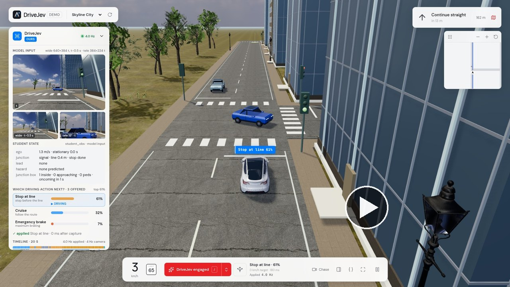
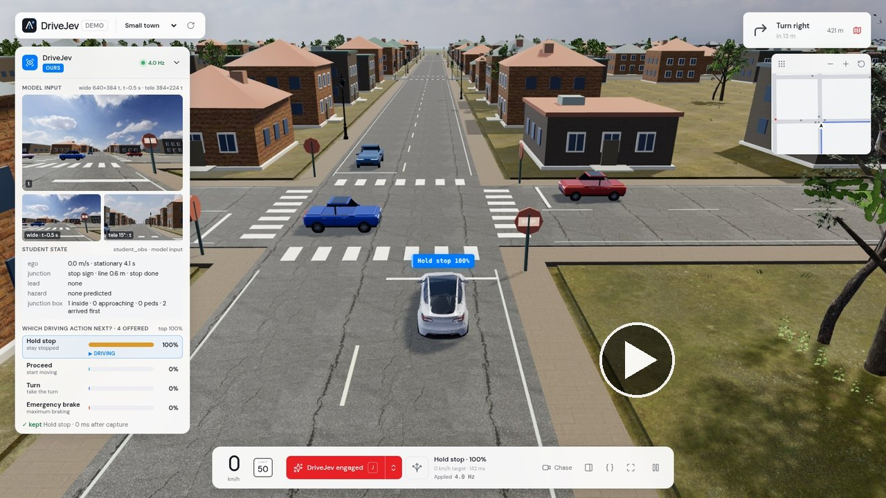
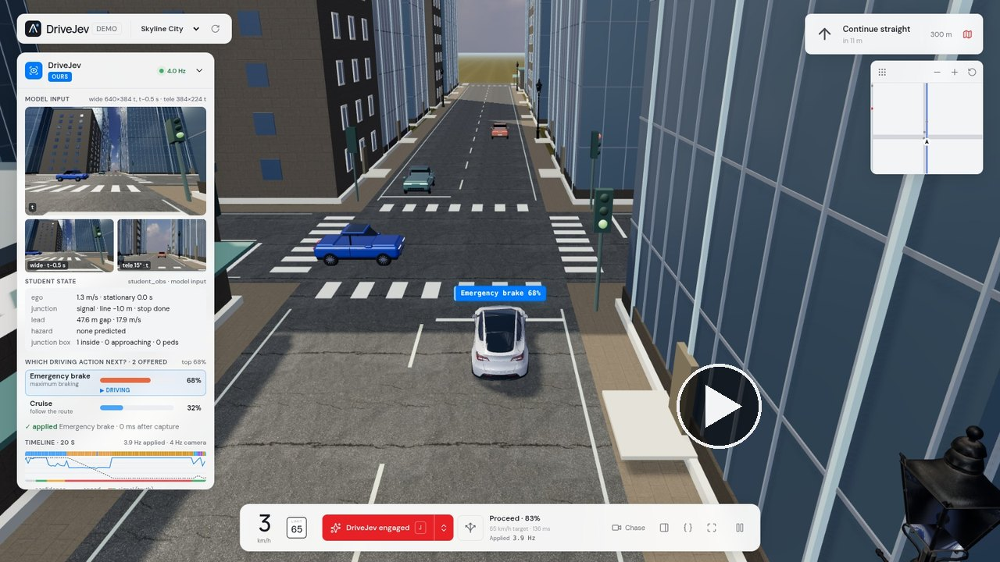
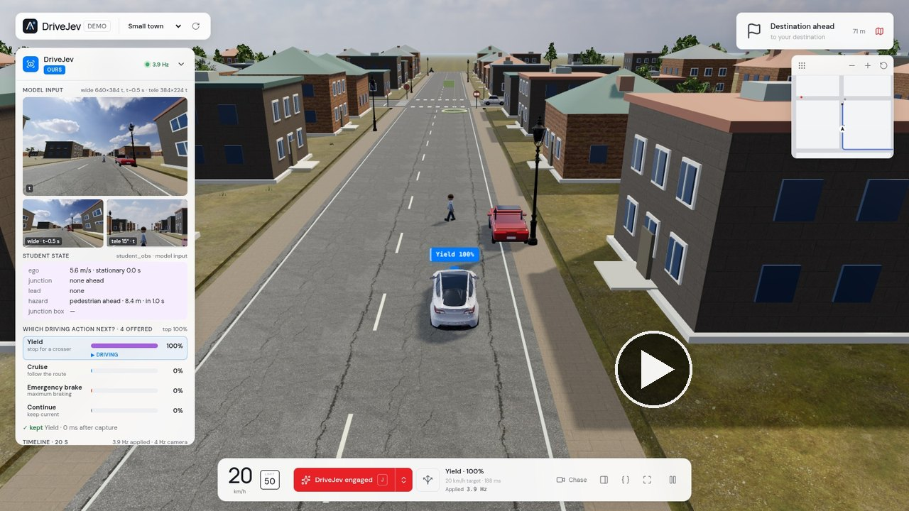
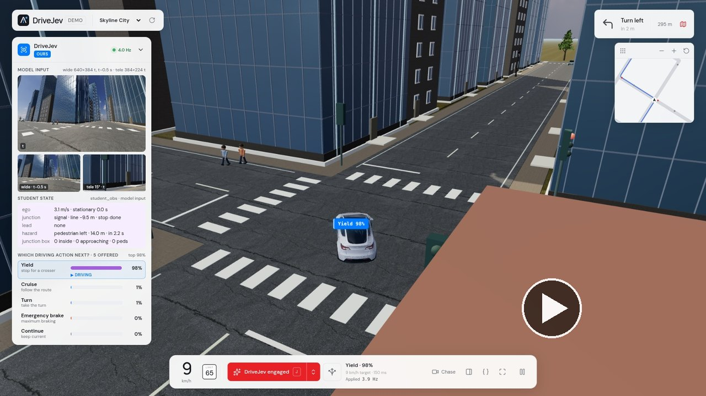
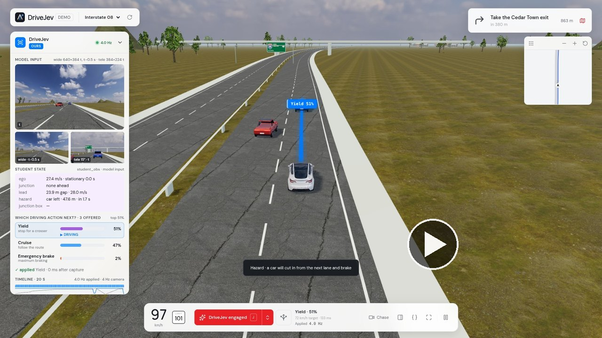
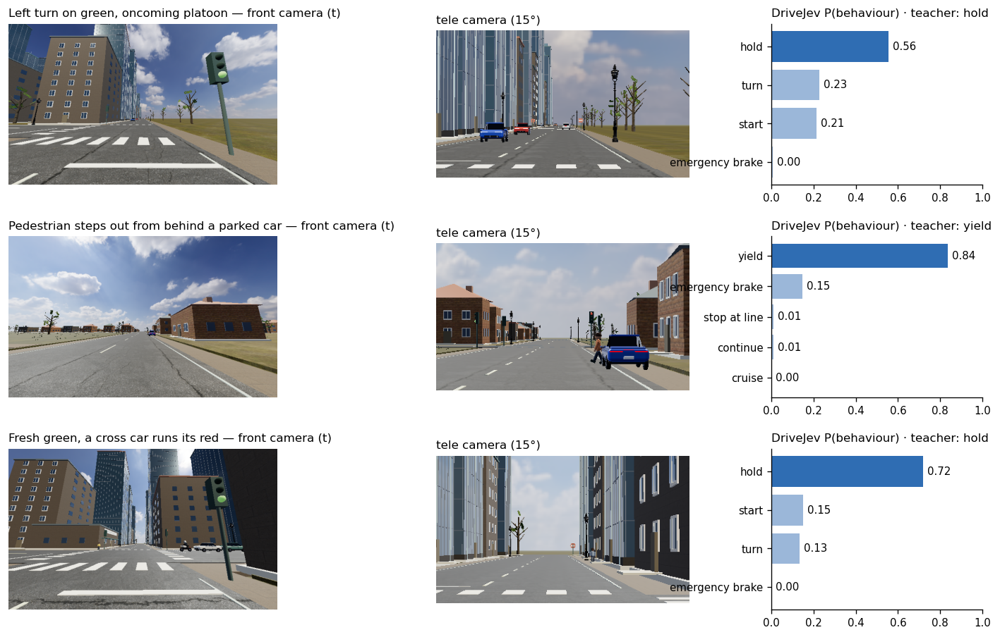
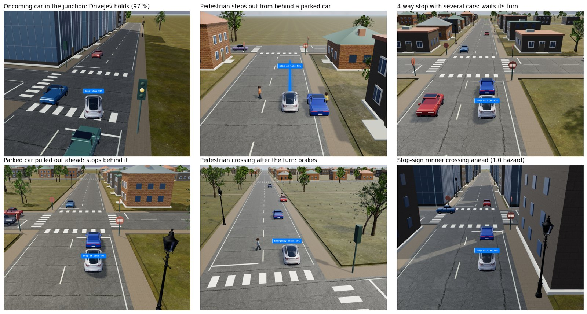

<h1 align="center">DriveJev</h1>

<h3 align="center">A vision-language driving policy that answers “what should the car do now?” with a probability for every offered behaviour</h3>

<p align="center">
  🤗 <a href="https://huggingface.co/benmagnifico/DriveJev-4B">Model</a> &nbsp;|&nbsp;
  🚗 <a href="https://github.com/standardagents/jevpilot">JevPilot simulator</a> &nbsp;|&nbsp;
  🧠 <a href="https://huggingface.co/Qwen/Qwen-Drive-1.0-4B">Qwen-Drive-1.0 backbone</a> &nbsp;|&nbsp;
  📄 <a href="docs/evaluation.md">Evaluation</a>
</p>

<table>
  <tr>
    <td align="center" width="33%"><a href="assets/demo/drivejev-oncoming.mp4"></a></td>
    <td align="center" width="33%"><a href="assets/demo/drivejev-4way-stop.mp4"></a></td>
    <td align="center" width="33%"><a href="assets/demo/drivejev-green-runner.mp4"></a></td>
  </tr>
  <tr>
    <td valign="top"><sub><b>Oncoming left-turner</b> — the light turns green, but an oncoming car turns left across its path; DriveJev holds at the line until it has cleared.</sub></td>
    <td valign="top"><sub><b>4-way stop</b> — three cars arrive; DriveJev comes to a full stop, waits while all three take their turn, then turns right.</sub></td>
    <td valign="top"><sub><b>Red-light runner after the green</b> — DriveJev moves off on green, a car runs its red from the left; it brakes at the line (68 %) and lets it pass.</sub></td>
  </tr>
  <tr>
    <td align="center" width="33%"><a href="assets/demo/drivejev-hidden-pedestrian.mp4"></a></td>
    <td align="center" width="33%"><a href="assets/demo/drivejev-turn-pedestrians.mp4"></a></td>
    <td align="center" width="33%"><a href="assets/demo/drivejev-cut-in.mp4"></a></td>
  </tr>
  <tr>
    <td valign="top"><sub><b>Pedestrian behind a parked car</b> — warned of a hidden pedestrian, DriveJev yields (100 %), stops as the pedestrian steps out, then drives on.</sub></td>
    <td valign="top"><sub><b>Pedestrians at the turn exit</b> — halfway through a left turn, DriveJev stops for two pedestrians on the exit crosswalk (yield 98 %), then completes the turn.</sub></td>
    <td valign="top"><sub><b>Cut-ins on the interstate</b> — three cars cut in within 20 s; DriveJev yields as the red one brakes in front of it and keeps its gap (98 → 40 km/h).</sub></td>
  </tr>
</table>

<p align="center"><sub>DriveJev 1.0 in the <a href="demo/">live demo</a> with JevPilot's normal traffic, AEB off and one interaction kind per drive
(<code>hazards=&lt;kind&gt;</code>; on the interstate <code>hazards=storm</code>, i.e. back-to-back cut-ins). Each full drive reached its destination
with no collision and no violation (seeds 7402, 7504, 7602, 7701, 7903, 7303). Of the 14 urban drives recorded for these clips, 11 met their
interaction — 10 cleanly, one crossed a red light at walking pace while yielding to a pedestrian at the turn exit — and 3 never did (no suitable
junction on the route); of the 5 interstate drives, one hit a car cutting in at 100 km/h. Recorded frame by frame in batch closed loop — the world
waits for each 4 Hz decision, as in the evaluation tables. Click a clip for the 720p video.</sub></p>

<p align="center">
  
</p>

> [!IMPORTANT]
> **News**
> - **[2026/10]** **DriveJev 1.0** — the weights are on Hugging Face
>   ([`benmagnifico/DriveJev-4B`](https://huggingface.co/benmagnifico/DriveJev-4B): backbone and decision head in one
>   folder), together with the inference code, the JevPilot closed-loop harness with hazard and multi-agent interaction
>   scenarios (unprotected left turns into an oncoming platoon, 4-way-stop contention, a red-light runner just after the
>   ego's green, a pedestrian hidden behind a parked car, cut-ins, pedestrians at the turn exit), the live demo and the
>   evaluation suites. On the interaction test suite DriveJev 1.0 drives **28/35 (80 %)** of the episodes cleanly against
>   10/35 (29 %) for a preview model trained without the interactions, with 1 collision instead of 24; on the base suite
>   it reaches 25/28 with 0 collisions ([results](#interaction-benchmark)). The training pipeline will be released later.

## Introduction

DriveJev turns the [Qwen-Drive-1.0](https://huggingface.co/Qwen/Qwen-Drive-1.0-4B) vision-language model into a
**decision model** in the spirit of TypeSafe's Jev: instead of generating text or a trajectory, it scores the
behaviours a local executor can actually carry out right now — *cruise*, *stop at the line*, *yield to the
pedestrian*, *turn*, *start*, *brake* — and returns a probability for each. The executor then turns the chosen
behaviour into steering and speed. The car drives closed-loop in [JevPilot](https://github.com/standardagents/jevpilot)
towns, cities and on the interstate, with traffic, pedestrians, traffic lights, stop signs, scripted hazards and
multi-agent interaction scenarios in which other road users have right of way, contend for a junction,
hide behind parked cars or cut in.

- **Prompt compiler.** Two wide front frames (t−0.5 s, t), one narrow *tele* frame for distant traffic lights,
  a whitelisted JSON state (ego, navigation, current behaviour, a perception summary) and the offered behaviours.
  Simulator truth — signal colours, traffic rules, other agents' plans — is rejected by construction; the model
  has to *see* the light.
- **Frozen VLM + decision head.** The 4.5 B-parameter Qwen-Drive VLM encodes the ~1,000-token prompt; a small head
  reads the hidden states at the `Decision:` token, the state block and each behaviour, and scores
  `q(decision, state) · k(behaviour)`.
- **Semantic executor.** Lane keeping along the route, a stop-line profile, adaptive cruise (gap to the perceived
  lead vehicle), a yield point in front of a predicted conflict and an optional collision-mitigation brake.
- **Observable teacher.** Labels come from a privileged policy that reads the traffic rules and rolls the world
  forward for every behaviour — but only with the road users the student's perception has seen, with a 0.6 s gap
  margin in front of moving vehicles, so every label can be explained from the model's inputs.

<p align="center">
  
</p>

### Highlights

- 🤝 **Multi-agent interactions.** Six scenario families on top of the three base hazards, each checked so that the
  privileged teacher always avoids the conflict (0 collisions in 242 scenario activations on the test suite) while a
  careless driver does not: a preview model trained without them collides in 24 of 35 interaction test episodes,
  DriveJev 1.0 in 1.
- 🚦 **The whole JevPilot world**, not one scripted junction: signals, stop signs (full stop + right of way), queues,
  turns and the interstate, with every episode on a random route through full traffic.
- 🎯 **A distribution, not free text.** Every decision is a probability over the behaviours that are executable
  at that instant; IDs never appear in the prompt and candidates are ordered canonically.
- 🔁 **Closed-loop data.** The teacher labels states visited by the teacher *and* by the model itself (DAgger), so the
  model learns to recover from its own mistakes; interaction-critical decisions are up-weighted.
- ⏱️ **Real time.** 137 ms median end-to-end per decision on one RTX 5090; in real-time runs 3.9 of the 4 decisions
  per second are applied while the world keeps moving.

## Results

### Interaction benchmark

Closed-loop drives on the **interaction test suite** (35 episodes, seeds never used for training or model selection):
12 town and 11 city random routes with all nine hazard and interaction kinds (one every 9–16 s), 8 `storm` episodes
(one every 4–7 s) and 4 interstate drives with cut-ins; full JevPilot traffic everywhere. Batch closed loop (the world
waits for each answer), AEB off unless stated, 160 s limit. Success = reached the destination with no collision and no
violation (red light, amber that could still be stopped for, unserved stop sign). *DriveJev preview (h4)* is an
unreleased development model trained without the interaction scenarios (observation schema 1.0).

<p align="center">
  <br>
  <sub>DriveJev 1.0 at the wheel of the live demo (chase view): holding inside the junction for an oncoming car during a left turn, a pedestrian stepping out from in front of a parked car, a queue at a 4-way stop, a parked car that has just pulled out ahead, a pedestrian crossing the road the car turns into, a stop-sign runner.</sub>
</p>

| Policy | Inputs | Success ↑ | Collisions ↓ (with hazard agent) | Violations ↓ | Route done | Stuck s/ep ↓ | Mean speed m/s |
|---|---|---|---|---|---|---|---|
| Observable teacher (privileged, upper bound) | simulator truth + rollouts of perceived agents | 97% <sub>[91, 100]</sub> (34/35) | 0 (0) | 0 | 99% | 0.5 | 7.6 |
| DriveJev preview (h4, no interaction training) | 3 frames + schema-1.0 state | 29% <sub>[14, 43]</sub> (10/35) | 24 (24) | 8 | 61% | 0.1 | 9.1 |
| DriveJev, interaction teacher data only (h5a, no new DAgger) | 3 frames + schema-1.1 state | 54% <sub>[37, 71]</sub> (19/35) | 12 (12) | 9 | 84% | 0.7 | 8.1 |
| **DriveJev 1.0 (ours, h5c)** | 3 frames + schema-1.1 state | 80% <sub>[66, 91]</sub> (28/35) | 1 (1) | 4 | 97% | 3.7 | 7.1 |
| DriveJev 1.0 (ours) + AEB | 3 frames + schema-1.1 state | 80% <sub>[66, 91]</sub> (28/35) | 1 (1) | 3 | 96% | 3.7 | 7.0 |

Per family (successes / episodes):

| Policy | town+interaction | city+interaction | town+storm | city+storm | highway |
|---|---|---|---|---|---|
| Observable teacher (privileged, upper bound) | 12/12 | 11/11 | 4/4 | 3/4 | 4/4 |
| DriveJev preview (h4, no interaction training) | 4/12 | 2/11 | 0/4 | 0/4 | 4/4 |
| DriveJev, interaction teacher data only (h5a, no new DAgger) | 7/12 | 6/11 | 1/4 | 1/4 | 4/4 |
| **DriveJev 1.0 (ours, h5c)** | 11/12 | 8/11 | 3/4 | 2/4 | 4/4 |
| DriveJev 1.0 (ours) + AEB | 11/12 | 9/11 | 2/4 | 2/4 | 4/4 |

Collisions per hazard kind (episodes that ended in contact with that hazard agent / activations of that kind):

| Policy | oncoming | stop_contention | green_runner | occluded_ped | cut_in | turn_ped | jaywalker | cross_runner | lead_brake |
|---|---|---|---|---|---|---|---|---|---|
| Observable teacher (privileged, upper bound) | 0/23 | 0/9 | 0/8 | 0/26 | 0/24 | 0/22 | 0/91 | 0/12 | 0/27 |
| DriveJev preview (h4, no interaction training) | 3/8 | 0/6 | 0/5 | 10/22 | 6/20 | 0/9 | 4/44 | 1/5 | 0/15 |
| DriveJev, interaction teacher data only (h5a, no new DAgger) | 3/12 | 0/9 | 0/6 | 2/32 | 5/23 | 0/22 | 2/67 | 0/7 | 0/21 |
| **DriveJev 1.0 (ours, h5c)** | 0/16 | 0/9 | 0/6 | 0/25 | 0/24 | 1/25 | 0/92 | 0/13 | 0/32 |
| DriveJev 1.0 (ours) + AEB | 0/19 | 0/7 | 0/5 | 0/25 | 0/24 | 1/28 | 0/91 | 0/11 | 0/33 |

- **From 10/35 to 28/35.** The preview model never saw these interactions: it collides in 24 of 35 test episodes, every time with a scripted hazard agent — most often the pedestrian hidden behind a parked car (10 of 22 activations) and cut-ins (6 of 20). DriveJev 1.0 collides once (a pedestrian walking into the stationary car at the exit of a turn) and none of the 16 oncoming platoons / left-turners, 25 hidden pedestrians, 24 cut-ins, 6 late red-light runners or 9 four-way-stop contentions ends in contact.
- **What each step buys** (validation, 24 episodes; full table in [docs/evaluation.md](docs/evaluation.md)): interaction teacher data alone 10 → 15 successes (14 → 6 collisions); up-weighting the decisions the teacher changed because of an interaction conflict removes the remaining collisions but makes the model hesitant (21 s per episode standing still although it could go); two DAgger rounds, in which DriveJev drives and the teacher relabels what it visits (the second with extra oncoming / red-light-runner / cut-in episodes), calibrate that caution: 19 / 24 with 2 collisions and 2.3 s stuck per episode. On the test suite the teacher-data-only head reaches 19/35 with 12 collisions.
- **No regression on the base suite**: 25/28 with 0 collisions (preview: 22/28, 2 collisions).
- **What is left.** Of the 7 test failures, 3 are amber crossings at 0.8–4.4 m/s (the light changes while the car creeps up to the line), 1 a red-light count for a car whose front had crossed on green but which crawled over the line until the light turned red, 2 time-outs in dense episodes after long waits, and 1 the turn-exit contact above; the teacher (34/35) shows the remaining headroom. AEB does not change the success rate (28/35; 62 interventions).

| Real-time closed loop (8 interaction test episodes, 1 worker) | Success | Collisions | Violations | Applied decisions | Latency p50 / p95 | Same 8 seeds, batch |
|---|---|---|---|---|---|---|
| DriveJev 1.0 (h5c) | 4/8 | 2 | 2 | 3.86 Hz | 137 / 143 ms | 5/8 |

In real time the world never waits: physics follows the wall clock at 20 Hz, one request is in flight at a time and answers whose observation is older than 0.5 s are dropped. Eight episodes are few; the two real-time crashes are in `storm` episodes, where hazards arrive every 4–7 s.

### Base suite

The base test suite (28 episodes: 8 town, 8 city, 10 with the three base hazards — `jaywalker`, `cross_runner`,
`lead_brake` — and 2 interstate) is the benchmark the preview model was developed on. It replays exactly in the
interaction world (`legacyHazards`); DriveJev 1.0 reads its own observation (schema 1.1) there.

| Base test suite (28 episodes) | Success | Collisions | Violations | Route done | Stuck s/ep | town | city | town+hazards | city+hazards | highway |
|---|---|---|---|---|---|---|---|---|---|---|
| Base reference teacher (privileged) | 96% <sub>[89, 100]</sub> (27/28) | 0 | 0 | 99% | 0.3 | 8/8 | 8/8 | 4/5 | 5/5 | 2/2 |
| DriveJev preview (h4) | 79% <sub>[61, 93]</sub> (22/28) | 2 | 5 | 95% | 0.3 | 5/8 | 8/8 | 3/5 | 4/5 | 2/2 |
| DriveJev preview (h4) + AEB | 79% <sub>[61, 93]</sub> (22/28) | 1 | 6 | 99% | 0.2 | 6/8 | 7/8 | 4/5 | 3/5 | 2/2 |
| **DriveJev 1.0 (ours, h5c)** | 89% <sub>[79, 100]</sub> (25/28) | 0 | 2 | 100% | 1.2 | 8/8 | 8/8 | 3/5 | 4/5 | 2/2 |

Model selection used only the 24-episode interaction validation suite (and, for the preview, the base validation
suite); the full validation tables, the rule fixed before each comparison and the preview's ablations (state-only
policy, no DAgger, linear head, LoRA) are in [docs/evaluation.md](docs/evaluation.md).

> Offline agreement with the teacher on held-out states is 95–98 % for every variant and does not separate good from
> bad policies; all comparisons above are closed-loop.

## Models

The weights are one self-contained folder on Hugging Face,
[`benmagnifico/DriveJev-4B`](https://huggingface.co/benmagnifico/DriveJev-4B) (tag `v1.0`):

```
DriveJev-4B/
├── drivejev_config.json   prompt/camera/behaviour contract, head configuration, observation schema
├── head.safetensors       decision head (pointer_mlp, 4.2 M parameters, FP32)
└── backbone/              Qwen-Drive-1.0-4B VLM: config, tokenizer, preprocessor, chat template, model.safetensors,
                           plus its NOTICE and Apache-2.0 LICENSE
```

| Release | Observation schema | Training data | Interaction test | Base test |
|---|---|---|---|---|
| **DriveJev 1.0** | 1.1 | base world: teacher episodes + 3 DAgger rounds; + interaction teacher episodes + 2 interaction DAgger rounds, conflict-weighted (119 k labels) | **28/35 (80 %)** | 25/28 |
| DriveJev preview (h4, not released) | 1.0 | base world: teacher episodes + 3 DAgger rounds | 10/35 (29 %) | 22/28 |

DriveJev 1.0 reads **observation schema 1.1**: the perception summary lets vehicles occlude and the junction block has
`oncoming_eta_s` / `cross_eta_s`. Schema 1.0 is the preview's observation (building occlusion only, no ETA fields); it
is kept so that schema-1.0 heads can be evaluated on exactly what they were trained on (`--set obs_schema=1.0`,
`serve.py --schema default=1.0`).

DriveJev 1.0 keeps the Qwen-Drive-1.0 VLM frozen, so `backbone/` is the original checkpoint (`lora_merged: false`) and
only the head is new. A rank-16 language-layer LoRA fine-tuned end to end from the released head (9 k interaction
decisions) was tried and not adopted — it reached 11/24 on the interaction validation suite with 11 collisions, against
19/24 for the frozen backbone (rule fixed before the run: adopt only if strictly better) — so this release has no
adapter to merge. `tools/export_hf.py` builds the folder from a backbone and a head checkpoint, records the observation
schema the head expects (the model service reports it; the harness and the demo build the matching observation), and
merges a PEFT LoRA adapter into the backbone when one is adopted (`--lora`), so fine-tuned variants load through the
same `DrivingPolicy.from_pretrained` call.

## Install

A GPU with 16 GB+ of memory is recommended (inference uses ≈ 11 GB).

```bash
git clone --recursive https://github.com/benmagnifico/DriveJev.git && cd DriveJev
# JevPilot is a submodule; it only needs its three.js dependency
(cd third_party/jevpilot && npm ci --omit=dev)

conda create -n drivejev python=3.10 && conda activate drivejev
pip install -r requirements.txt
pip install -e /path/to/Qwen-Drive-1.0          # the qwen_drive package released with Qwen-Drive-1.0
npm install playwright && npx playwright install chromium   # headless closed-loop runs
```

**Note:** the linear-attention kernels compile with Triton on first use; if Triton cannot find `ptxas`, point
`TRITON_PTXAS_PATH` at the one from your CUDA toolkit.

## Quick start

`examples/observations/` bundles six real decisions recorded in JevPilot — a red light 68 m ahead at 14 m/s
(visible only in the tele view), a served stop sign with a clear junction, a pedestrian stepping out 31 m ahead, and
three interactions (a left turn on green into an oncoming platoon, a pedestrian stepping out from behind a parked
car, a fresh green with a cross car running its red) — each with its two wide frames, tele frame, state and offered
behaviours, so the command below needs nothing but the weights.

```bash
python examples/predict.py --model benmagnifico/DriveJev-4B          # or a local released folder
```

```python
from drivejev import DrivingPolicy

policy = DrivingPolicy.from_pretrained("benmagnifico/DriveJev-4B", device="cuda:0")
record = {
    "student_obs": {...},                     # ego / nav / maneuver / recent_actions / traffic (docs/simulator.md)
    "candidates": [{"candidate_id": "stop_at_line", "action_type": "stop_at_line", "target_id": "j2-1",
                    "speed_profile": "line_stop", "description": "Approach and stop ..."}, ...],
    "images": [{"camera": "front", "relative_time": -0.5, "path": "front_t-0.5.png"},
               {"camera": "front", "relative_time": 0, "path": "front_t0.png"},
               {"camera": "front_tele", "relative_time": 0, "path": "tele_t0.png"}],
}
out = policy.predict(record)
print(out["candidate_id"], out["probabilities"])   # chosen behaviour + a probability for every offered one
```

The HTTP service used by the simulator and the demo takes the same record with base64 PNGs:

```bash
python serve/serve.py --model benmagnifico/DriveJev-4B --port 9031
# POST /predict {"student_obs": ..., "candidates": [...], "images": [{"camera": "front", "relative_time": -0.5, "png_base64": "..."}, ...]}
```

## Evaluation

Closed-loop episodes run in headless Chrome: JevPilot physics at 20 Hz, cameras and decisions at 4 Hz.

```bash
python serve/serve.py --model benmagnifico/DriveJev-4B --port 9031 &
# interaction benchmark
node simulator/run.mjs --jobs eval/suites/interaction_test.json --out runs/itest --workers 4 --model-url http://127.0.0.1:9031/predict
node simulator/run.mjs --jobs eval/suites/interaction_test.json --out runs/itest-teacher --set policy=teacher   # upper bound, no GPU
# base suite (replays exactly)
node simulator/run.mjs --jobs eval/suites/test.json --out runs/test --workers 4
node simulator/run.mjs --jobs eval/suites/test.json --out runs/test-aeb --set aeb=true            # with AEB
node simulator/run.mjs --jobs eval/suites/interaction_test.json --out runs/itest-rtc --workers 1 --set realtime=true
python eval/summarize.py runs/itest runs/itest-teacher
```

A head trained on observation schema 1.0 (such as the preview) is evaluated on its own observation with
`--set obs_schema=1.0` (serve it with `--schema default=1.0`).
`PLAYWRIGHT_MODULE` / `CHROME_PATH` point the runner at a specific Playwright build or Chrome binary. Use one
worker for real-time runs so that measured latency is not inflated by other episodes sharing the GPU. See
[docs/evaluation.md](docs/evaluation.md) for metric definitions and [docs/scenarios.md](docs/scenarios.md) for the suites.

## Live demo

<p align="center"><br><sub>Skyline City with the interaction scenarios on: DriveJev 1.0 turns left on a light that has just gone amber, waits inside the junction for an oncoming car with right of way (state: a car 7.7 m to the right, conflict in 1.8 s, oncoming vehicle 1.2 s from the junction) and chooses <i>hold</i> (97 %). The panel shows the model input (wide t, wide t−0.5 s, tele t), the state it read and the probability of every offered behaviour.</sub></p>

```bash
DRIVEJEV_MODEL=benmagnifico/DriveJev-4B bash demo/start.sh      # model service :9031 + web app :9030
```

Open <http://127.0.0.1:9030>, press **J** to engage. The left panel shows what the model saw (both wide frames and
the tele view), the state it read, every offered behaviour with its probability, whether the executor applied the
answer, and a 20 s timeline. URL parameters select the world (`world=town|city|highway`), the seed, the scripted
hazard and interaction scenarios (`hazards=1`, `hazards=storm`, or a list such as `hazards=oncoming,occluded_ped`)
and AEB (`aeb=off`); the observable teacher, local Kev and cloud Jev can be selected as other pilots.
Details: [demo/README.md](demo/README.md).

## Documentation

| Doc | Contents |
| --- | --- |
| [docs/simulator.md](docs/simulator.md) | clock, cameras, behaviours, executor rules, perception and the student observation, the teachers |
| [docs/scenarios.md](docs/scenarios.md) | worlds, random routes, hazard and interaction scenarios, validation/test suites |
| [docs/evaluation.md](docs/evaluation.md) | metrics, protocols, full result tables, ablations |
| [demo/README.md](demo/README.md) | the interactive JevPilot demo |

## Repository layout

```
DriveJev/
├── drivejev/           # prompt compiler, decision heads, frozen-backbone encoder, DrivingPolicy
├── serve/serve.py      # HTTP model service (POST /predict)
├── simulator/          # JevPilot adapter: world + hazards + interactions, executor + perception, teachers, harness, runner
├── demo/               # interactive JevPilot demo with the decision panel
├── eval/               # validation/test suites and the summarizer
├── examples/           # bundled observations for the quick start
├── tools/export_hf.py  # package backbone (+ merged LoRA) and head for the Hugging Face Hub
├── third_party/        # JevPilot (git submodule)
├── assets/  docs/
```

## Acknowledgements

DriveJev builds on [Qwen-Drive-1.0](https://huggingface.co/Qwen/Qwen-Drive-1.0-4B) (the VLM backbone and image
processing), [JevPilot](https://github.com/standardagents/jevpilot) (the driving world, physics, traffic and rules),
and the decision-model idea of TypeSafe's Jev and its open reconstruction Kev.

## Citation

If you find DriveJev helpful, feel free to cite it.

```bibtex
@misc{li2026drivejev,
  title  = {DriveJev: Choosing Executable Driving Behaviours with a Vision-Language Decision Model},
  author = {Jingguang Li},
  year   = {2026},
  howpublished = {\url{https://github.com/benmagnifico/DriveJev}}
}
```

## License

The DriveJev code is released under the MIT license ([LICENSE](LICENSE)). The Qwen-Drive-1.0 weights keep their
Apache 2.0 license; JevPilot keeps its own terms.
