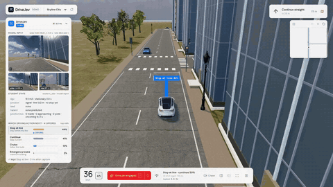
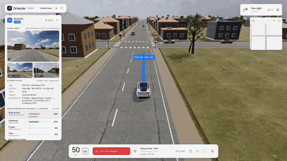
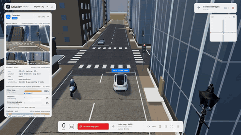
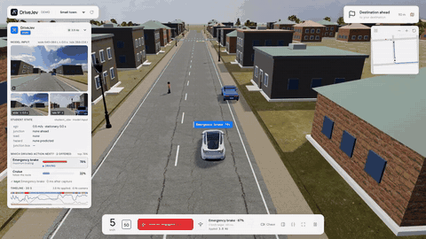
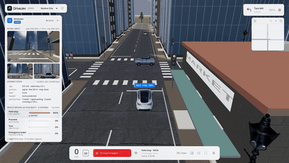
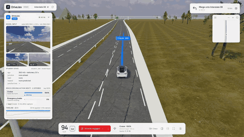
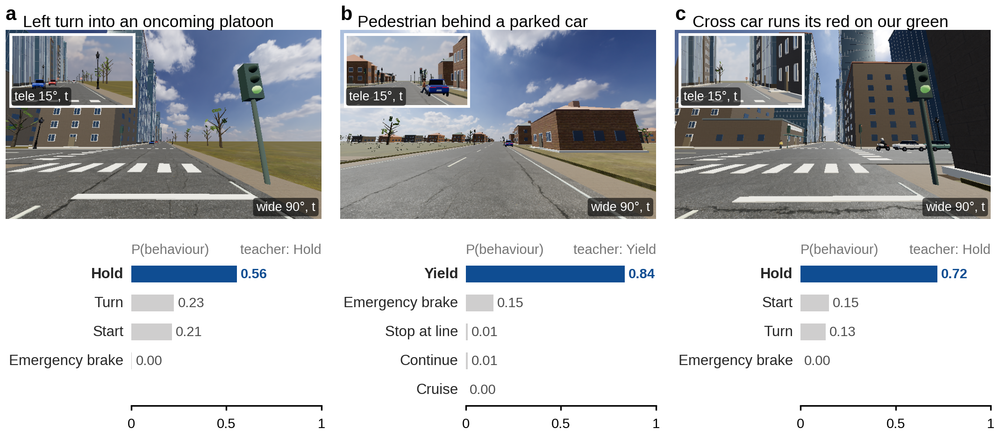
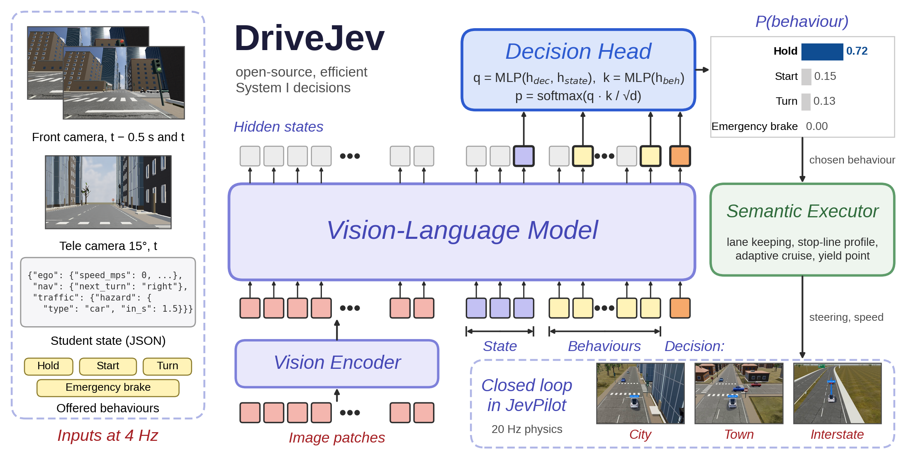
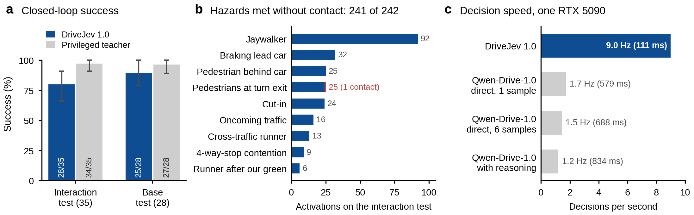

<h1 align="center">DriveJev</h1>

<h3 align="center">An open-source, efficient System I decision model for autonomous driving</h3>

<p align="center">
  <a href="https://huggingface.co/benmagnifico/DriveJev-4B">Model</a> &nbsp;|&nbsp;
  <a href="#live-demo">Live demo</a> &nbsp;|&nbsp;
  <a href="docs/evaluation.md">Evaluation</a> &nbsp;|&nbsp;
  <a href="https://github.com/standardagents/jevpilot">JevPilot simulator</a>
</p>

<table>
  <tr>
    <td width="33%"><a href="assets/demo/drivejev-oncoming.mp4"></a></td>
    <td width="33%"><a href="assets/demo/drivejev-4way-stop.mp4"></a></td>
    <td width="33%"><a href="assets/demo/drivejev-green-runner.mp4"></a></td>
  </tr>
  <tr>
    <td width="33%"><a href="assets/demo/drivejev-hidden-pedestrian.mp4"></a></td>
    <td width="33%"><a href="assets/demo/drivejev-turn-pedestrians.mp4"></a></td>
    <td width="33%"><a href="assets/demo/drivejev-cut-in.mp4"></a></td>
  </tr>
</table>

<p align="center"><sub>DriveJev 1.0 at the wheel in JevPilot with full traffic. Top: an oncoming car turning left across our path, a 4-way stop shared with three cars, a red-light runner just after our green.
Bottom: a pedestrian stepping out from behind a parked car, pedestrians at the exit of a left turn, three cut-ins on the interstate.
Every drive reached its destination with no collision and no violation. Click a clip for the 720p video.</sub></p>

<p align="center">
  <br>
  <sub>Three test situations: the front camera with the tele view (inset) and the probability DriveJev 1.0 gives each offered behaviour.</sub>
</p>

> [!IMPORTANT]
> **News**
> - **[2026/10]** **DriveJev 1.0** is open source: the code, the model on Hugging Face
>   ([`benmagnifico/DriveJev-4B`](https://huggingface.co/benmagnifico/DriveJev-4B)), the JevPilot closed-loop harness
>   and a live demo. On held-out closed-loop tests it drives 28 of 35 interaction episodes and 25 of 28 base episodes
>   cleanly, meets 241 of 242 scripted hazards without contact and makes a decision in 111 ms on one GPU.

## Introduction

DriveJev is a System I driving model: like a fast, intuitive human driver, it does not write out its reasoning or
plan a trajectory. At every decision it looks at three camera frames and a short description of the situation,
scores the behaviours the car can carry out at that instant (*cruise*, *stop at the line*, *hold*, *start*,
*turn*, *yield*, *brake*) and returns a probability for each, all in one forward pass. A local executor turns the
chosen behaviour into steering and speed. DriveJev drives closed loop in the [JevPilot](https://github.com/standardagents/jevpilot)
town, city and interstate with traffic, pedestrians, traffic lights, stop signs and scripted multi-agent
interactions.

Our contributions:

- **Driving ability.** DriveJev follows the traffic rules and drives steadily on city streets, small-town roads and
  the interstate, through junctions with traffic lights and with stop signs, among other cars and pedestrians. On
  held-out test drives it reaches the destination with no collision and no violation in 28 of 35 interaction
  episodes and 25 of 28 base episodes, and meets 241 of 242 scripted hazards (oncoming platoons, red-light runners,
  hidden pedestrians, cut-ins, 4-way-stop contention) without contact. In the same worlds, JevPilot's own autopilot,
  which asks the cloud Jev model to pick one of many sampled steering paths, does not hold a straight line in complex
  traffic.
- **Inference speed.** A decision is a single forward pass with no text or trajectory decoding. DriveJev decides in
  111 ms (9 Hz) on one RTX 5090, while the Qwen-Drive-1.0 model it builds on runs at 1.2 to 1.7 Hz as a trajectory
  planner on the same GPU, and the cloud Jev API answers at about 4 to 5 Hz.
- **Extensibility.** Code, weights, simulator harness and demo are open and run locally on one GPU. DriveJev can be
  inspected, retrained and fine-tuned on new scenarios, which gives it room to grow towards complex and high-risk
  situations that a closed cloud model cannot be adapted to.

<p align="center">
  
</p>

## Results

<p align="center">
  
</p>

| Test suite | Policy | Success ↑ | Collisions ↓ | Violations ↓ | Route completed ↑ |
|---|---|---|---|---|---|
| Interaction (35 episodes) | Privileged teacher (upper bound) | 97% <sub>[91, 100]</sub> (34/35) | 0 | 0 | 99% |
| | **DriveJev 1.0** | **80% <sub>[66, 91]</sub> (28/35)** | **1** | **4** | **97%** |
| Base (28 episodes) | Privileged teacher (upper bound) | 96% <sub>[89, 100]</sub> (27/28) | 0 | 0 | 99% |
| | **DriveJev 1.0** | **89% <sub>[79, 100]</sub> (25/28)** | **0** | **2** | **100%** |

Closed-loop drives on seeds never used for training or model selection: the world waits for each 4 Hz decision, AEB
is off, and success means reaching the destination with no collision and no violation (red light, amber that could
still be stopped for, unserved stop sign). The interaction suite has town and city random routes with all nine
hazard and interaction kinds, back-to-back `storm` episodes and interstate drives with cut-ins; the base suite has
random routes, the three base hazards and the interstate. Brackets are 95 % bootstrap intervals.

- **Cameras in, rules out.** The privileged teacher reads signal states and right of way from the simulator and
  rolls the world forward for every behaviour. DriveJev gets none of that: it reads the light from the camera and
  the situation from a perception summary, and still completes 28 of 35 interaction drives and 25 of 28 base drives.
  In the tele camera a traffic light 50 m away covers about five pixels instead of one, which is what lets the car
  stop from city speed.
- **Safe in multi-agent interactions.** None of the 16 oncoming platoons and left-turners, 25 pedestrians hidden
  behind parked cars, 24 cut-ins, 6 late red-light runners, 9 four-way-stop contentions or 92 jaywalkers ends in
  contact. Each of these needs a real decision (wait for a gap, yield, go) rather than a reflex.
- **Fast enough for the loop.** The model needs 111 ms per decision. In real-time runs, where the world never waits,
  3.9 of the 4 decisions requested per second are applied, with a median round trip of 137 ms.

Per-family results, per-hazard tables, metric definitions and protocols are in [docs/evaluation.md](docs/evaluation.md).

## Model

The weights are one self-contained folder on Hugging Face,
[`benmagnifico/DriveJev-4B`](https://huggingface.co/benmagnifico/DriveJev-4B) (tag `v1.0`):

```
DriveJev-4B/
├── drivejev_config.json   prompt, camera and behaviour contract, decision-head configuration
├── head.safetensors       decision head (4.2 M parameters, FP32)
└── backbone/              vision-language backbone: config, tokenizer, weights, NOTICE and Apache-2.0 LICENSE
```

What makes DriveJev work:

- **One decision, one forward pass.** The prompt holds two wide front frames 0.5 s apart (motion), one tele frame
  with a 15° field of view (traffic lights and pedestrians 40 to 90 m ahead), the state as JSON and the offered
  behaviours, and ends in a `Decision:` token. About 1,000 tokens, encoded once; nothing is decoded.
- **Pointer decision head.** The head reads three kinds of hidden states: the `Decision:` token, the end of the state
  block and the last token of every behaviour. It scores each behaviour by the dot product of `q(decision, state)` and `k(behaviour)` and normalises over
  whatever 2 to 8 behaviours are offered, so one head serves every situation.
- **A prompt that cannot cheat.** The compiler accepts only whitelisted state fields (ego, navigation, current
  behaviour, perception summary) and rejects anything else, so signal colours, traffic rules and other agents' plans
  never reach the model. Behaviour IDs never appear in the text and the behaviours are put in a canonical order.
- **Observable teacher.** Labels come from a privileged policy that reads the traffic rules and rolls the world
  forward for every behaviour, using only the road users the student's perception has seen and a 0.6 s gap margin
  in front of moving vehicles, so every label can be explained from the model's inputs.
- **Closed-loop training data.** Teacher drives with small perturbations, then rounds in which DriveJev drives and
  the teacher relabels every state it visits (DAgger), so the model learns to recover from its own mistakes;
  decisions changed by an interaction conflict are up-weighted. 119 k labels in total.
- **Semantic executor.** Lane keeping along the route, a stop-line profile, adaptive cruise behind the perceived lead
  vehicle, a yield point in front of a predicted conflict and an optional collision-mitigation brake.

Details: [docs/model.md](docs/model.md) (prompt, encoder, head, training) and [docs/simulator.md](docs/simulator.md)
(executor, observation, teacher).

## Install

A GPU with 16 GB or more is recommended (inference uses about 11 GB). Tested with Python 3.10, CUDA 12.8, Node.js 22
and one RTX 5090.

```bash
# 1. Code, with the JevPilot driving world as a git submodule
git clone --recursive https://github.com/benmagnifico/DriveJev.git && cd DriveJev
# cloned without --recursive?  git submodule update --init

# 2. JevPilot (Node.js 22 or newer)
cd third_party/jevpilot
npm ci                  # three.js, icons and JevPilot's own dev tools
                        # (DriveJev itself only needs three.js: npm ci --omit=dev is enough)
npm run dev             # optional: JevPilot on its own at http://localhost:5173 (WASD to drive, Space to brake)
cd ../..

# 3. Python environment
conda create -n drivejev python=3.10 -y && conda activate drivejev
pip install -r requirements.txt
npm install playwright && npx playwright install chromium     # headless Chrome for closed-loop runs

# 4. Model weights from Hugging Face
hf download benmagnifico/DriveJev-4B --local-dir checkpoints/DriveJev-4B
```

Every command below also accepts the repo id `benmagnifico/DriveJev-4B` in place of the local folder; the weights are
then downloaded on first use.

**Note:** the linear-attention kernels compile with Triton on first use; if Triton cannot find `ptxas`, point
`TRITON_PTXAS_PATH` at the one from your CUDA toolkit.

## Quick start

`examples/observations/` bundles six real decisions recorded in JevPilot: a red light 68 m ahead at 14 m/s (visible
only in the tele view), a served stop sign with a clear junction, a pedestrian stepping out 31 m ahead, a left turn on
green into an oncoming platoon, a pedestrian stepping out from behind a parked car, and a fresh green with a cross car
running its red. Each has its two wide frames, tele frame, state and offered behaviours.

```bash
python examples/predict.py --model checkpoints/DriveJev-4B
```

```python
from drivejev import DrivingPolicy

policy = DrivingPolicy.from_pretrained("checkpoints/DriveJev-4B", device="cuda:0")
record = {
    "student_obs": {...},                     # ego / nav / maneuver / recent_actions / traffic (docs/simulator.md)
    "candidates": [{"candidate_id": "stop_at_line", "action_type": "stop_at_line", "target_id": "j2-1",
                    "speed_profile": "line_stop", "description": "Approach and stop ..."}, ...],
    "images": [{"camera": "front", "relative_time": -0.5, "path": "front_t-0.5.png"},
               {"camera": "front", "relative_time": 0, "path": "front_t0.png"},
               {"camera": "front_tele", "relative_time": 0, "path": "tele_t0.png"}],
}
out = policy.predict(record)
print(out["candidate_id"], out["probabilities"])   # chosen behaviour + a probability for every offered one
```

The HTTP service used by the simulator and the demo takes the same record with base64 PNGs:

```bash
python serve/serve.py --model checkpoints/DriveJev-4B --port 9031
# POST /predict {"student_obs": ..., "candidates": [...], "images": [{"camera": "front", "relative_time": -0.5, "png_base64": "..."}, ...]}
```

## Evaluation

Closed-loop episodes run in headless Chrome: JevPilot physics at 20 Hz, cameras and decisions at 4 Hz.

```bash
python serve/serve.py --model checkpoints/DriveJev-4B --port 9031 &
# interaction benchmark
node simulator/run.mjs --jobs eval/suites/interaction_test.json --out runs/itest --workers 4 --model-url http://127.0.0.1:9031/predict
node simulator/run.mjs --jobs eval/suites/interaction_test.json --out runs/itest-teacher --set policy=teacher   # upper bound, no GPU
# base suite
node simulator/run.mjs --jobs eval/suites/test.json --out runs/test --workers 4
# real time (one worker, so that latency is not shared with other episodes)
node simulator/run.mjs --jobs eval/suites/interaction_test.json --out runs/itest-rtc --workers 1 --set realtime=true
python eval/summarize.py runs/itest runs/itest-teacher
```

`--set aeb=true` turns on the collision-mitigation brake. `PLAYWRIGHT_MODULE` / `CHROME_PATH` point the runner at a
specific Playwright build or Chrome binary. Metric definitions are in [docs/evaluation.md](docs/evaluation.md) and the
suites in [docs/scenarios.md](docs/scenarios.md).

## Live demo

<p align="center"><br><sub>Skyline City: DriveJev 1.0 turns left as the light goes amber, waits inside the junction for an oncoming car with right of way and chooses <i>hold</i> (97 %). The panel shows the model input (wide t, wide t-0.5 s, tele t), the state it read and the probability of every offered behaviour.</sub></p>

```bash
DRIVEJEV_MODEL=checkpoints/DriveJev-4B bash demo/start.sh      # model service :9031 + web app :9030
```

Open <http://127.0.0.1:9030> and press **J** to engage. The left panel shows what the model saw (both wide frames and
the tele view), the state it read, every offered behaviour with its probability, whether the executor applied the
answer, and a 20 s timeline. URL parameters select the world (`world=town|city|highway`), the seed, the scripted
hazard and interaction scenarios (`hazards=1`, `hazards=storm`, or a list such as `hazards=oncoming,occluded_ped`)
and AEB (`aeb=off`); the privileged teacher and the cloud Jev can be selected as other pilots for comparison.
Details: [demo/README.md](demo/README.md).

## Documentation

| Doc | Contents |
| --- | --- |
| [docs/model.md](docs/model.md) | prompt, encoder, decision head, training |
| [docs/simulator.md](docs/simulator.md) | clock, cameras, behaviours, executor rules, perception and the student observation, the teacher |
| [docs/scenarios.md](docs/scenarios.md) | worlds, random routes, hazard and interaction scenarios, test suites |
| [docs/evaluation.md](docs/evaluation.md) | metrics, protocols, full result tables |
| [demo/README.md](demo/README.md) | the interactive JevPilot demo |

## Repository layout

```
DriveJev/
├── drivejev/           # prompt compiler, image patching, decision heads, backbone loader, DrivingPolicy
├── serve/serve.py      # HTTP model service (POST /predict)
├── simulator/          # JevPilot adapter: world, hazards and interactions, executor and perception, teacher, harness, runner
├── demo/               # interactive JevPilot demo with the decision panel
├── eval/               # test suites and the summarizer
├── examples/           # bundled observations for the quick start
├── tools/export_hf.py  # packages a model folder for the Hugging Face Hub
├── third_party/        # JevPilot (git submodule)
├── assets/  docs/
```

## Acknowledgements

DriveJev builds on [Qwen-Drive-1.0](https://huggingface.co/Qwen/Qwen-Drive-1.0-4B) (the vision-language backbone and
its image processing), [JevPilot](https://github.com/standardagents/jevpilot) (the driving world, physics, traffic and
rules), and the decision-model idea of TypeSafe's Jev and its open reconstruction Kev.

## Citation

If you find DriveJev helpful, feel free to cite it.

```bibtex
@misc{li2026drivejev,
  title  = {DriveJev: Choosing Executable Driving Behaviours with a Vision-Language Decision Model},
  author = {Jingguang Li},
  year   = {2026},
  howpublished = {\url{https://github.com/benmagnifico/DriveJev}}
}
```

## License

The DriveJev code is released under the MIT license ([LICENSE](LICENSE)). The backbone weights in the model folder
keep their Apache 2.0 license; JevPilot keeps its own terms.
