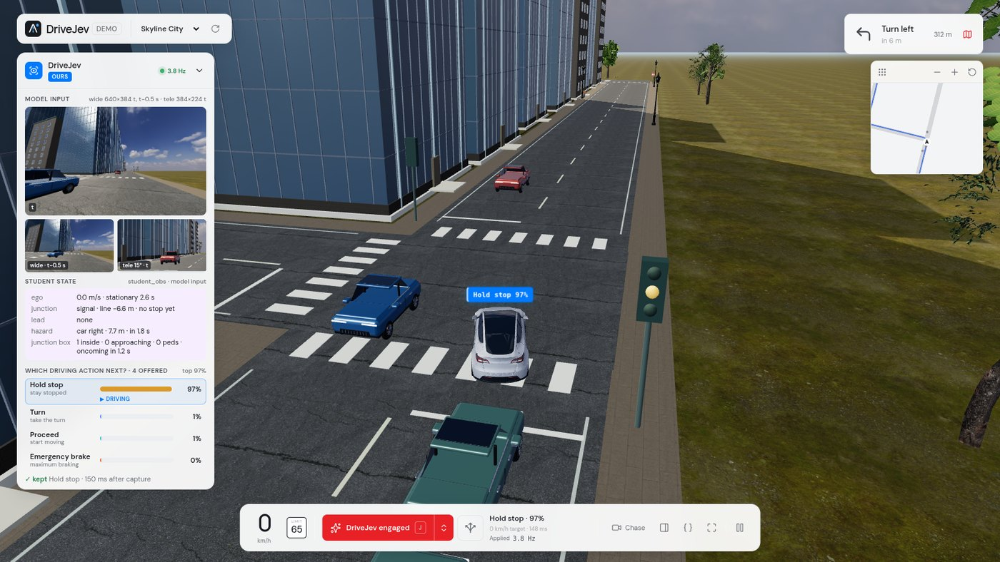

# DriveJev interactive demo

Drive the [JevPilot](https://github.com/standardagents/jevpilot) world (a small town, a city and the interstate, with traffic, pedestrians, traffic lights, stop signs and optional scripted hazards and multi-agent interactions) with DriveJev at the wheel, and watch every decision live: what the model saw, which behaviours it was offered, the probability it gave each one, and whether the executor applied the answer.

<p align="center"><br>
<sub>Skyline City with the interaction scenarios on: DriveJev 1.0 turns left as the light goes amber, waits inside the junction for an oncoming car with right of way and chooses <i>Hold</i> (97 %). The panel shows the model input (wide frames at t and t-0.5 s and the tele frame), the student state (a car 7.7 m to the right, conflict in 1.8 s; junction box: oncoming vehicle 1.2 s away) and the probability of every offered behaviour.</sub></p>

## Start

From the repository root, after the [install steps](../README.md#install) (JevPilot is the `third_party/jevpilot` submodule):

```bash
DRIVEJEV_MODEL=checkpoints/DriveJev-4B bash demo/start.sh     # or the Hugging Face repo id benmagnifico/DriveJev-4B
```

Then open <http://127.0.0.1:9030>. The script starts the model service (`serve/serve.py`, port 9031) unless one already answers there, then the web server. The page is usable while the model loads; the DriveJev pilot becomes available once the service is ready. Without any model the web server still starts and the privileged teacher can drive.

The two parts can also be started separately:

```bash
python serve/serve.py --model checkpoints/DriveJev-4B --port 9031    # GPU environment from the main README
python demo/server.py --port 9030 --model-url http://127.0.0.1:9031  # Python standard library only
```

Optional environment variables for `start.sh`: `PYTHON` (interpreter), `WEB_PORT`, `MODEL_PORT`, `OPENROUTER_API_KEY` (enables the cloud Jev pilot; read by the server only, never sent to the browser) and `KEV_URL` (a local server speaking the Jev `/v1/systemone` API). The web server binds to 127.0.0.1.

## URL parameters

| Parameter | Effect |
| --- | --- |
| `world=town\|city\|highway` | driving scene (default `town`) |
| `seed=<int>` | world seed (random if omitted; random demo worlds avoid the training, validation and test seeds 300000 to 329999 and 400000 to 429999) |
| `route=default` | keep JevPilot's default route in town/city (otherwise a seeded random route across the grid; the interstate always uses its default route) |
| `hazards=1` | scripted hazard and interaction scenarios, one at most every 9 to 16 s: the three base hazards (jaywalker, red-light / stop-sign runner, hard-braking lead) and the six interaction scenarios (oncoming platoon / left-turner, 4-way-stop contention, late red-light runner after your green, pedestrian hidden behind a parked car, cut-in, pedestrians at the turn); the interstate only has cut-ins |
| `hazards=storm` / `hazards=classic` / `hazards=oncoming,cut_in` | all kinds back to back (4 s cooldown) / only the three base hazards / only the listed kinds |
| `aeb=off` | start with collision-mitigation braking off (on by default in the demo) |
| `pilot=drivejev\|teacher\|kev\|jev` | initial pilot |
| `arm=<name>` | decision head to request when the model service serves several (default `default`) |

## Controls

| Key | Action |
| --- | --- |
| J | engage / disengage the pilot |
| M, or the arrows next to the engage button | choose the pilot (1 to 4 select directly); the menu also has the AEB and **Hazard scenarios** switches (the latter rebuilds the world) |
| C | cycle chase, driver and bird's-eye camera; drag to orbit, scroll to zoom, double-click to recenter |
| I | show / hide the decision panel |
| candidates button | show every offered behaviour as a 3-D preview with its probability |
| { } | inspect the exact model input (images shown as sizes), perception, the full world and the response |
| WASD / Space / P | drive manually / brake / pause (any driving key takes back control) |

## Pilots

| Pilot | Input | Output |
| --- | --- | --- |
| **DriveJev (ours)** | wide front frames at t−0.5 s and t (640×384), tele frame at t (384×224), the whitelisted student state, the offered behaviours | probabilities over the behaviours, executed by the semantic executor |
| Privileged teacher | true signal / stop rule + a 4.5 s rollout per behaviour of the road users its perception has seen (the observable teacher); no camera | the teacher's preferred behaviour, executed by the semantic executor |
| Kev (local, optional) | JevPilot's structured state + sampled path candidates | Jev-style choice probabilities |
| Jev (cloud, optional) | same as Kev, via the OpenRouter Decisions API (`~typesafe/jev-latest`) | same; token use and cost are shown |

A pilot that is not available says why in the menu (model service offline, head not served, `OPENROUTER_API_KEY` not configured, Kev not running).

## What the panel shows

- **Model input**: the wide frame at t, with the wide frame at t−0.5 s and the tele frame side by side below it (a live preview of the same cameras before you engage), and the **student state** the model reads as text: speed and time stationary, junction control and stop-line distance, whether the stop has been completed, lead-vehicle gap and speed, the predicted path conflict (type, time, distance, side), junction occupancy and the time until the nearest oncoming / crossing vehicle reaches the junction. The privileged teacher also shows the ground truth it reads.
- **Decision**: one bar per offered behaviour (cruise, stop at line, hold, proceed, turn, yield, continue, emergency brake); `chosen` marks the answer, `▶ driving` what the executor is doing, and the line below says whether the answer was applied or why not (older than 0.5 s, offered behaviours changed while thinking, hysteresis).
- **Timeline**: 20 s of chosen behaviour, confidence, speed and the true signal state (teacher only).
- **Footer**: round-trip latency, requests / not applied / skipped frames, red-light and missed-stop crossings, AEB interventions, triggered hazards, and the ground-truth signal / hazard ahead (never a model input).

## Fidelity to the closed-loop harness

The DriveJev pilot is fed exactly as in `simulator/harness.mjs`:

- **Separate model camera.** A second JevPilot scene bound to the same world is built under the training render profile (pixel ratio 1, no antialiasing, no shadows, low-detail foliage, a fresh wind material per world) and rendered with the ego car and all annotations hidden: the wide view (640×384, VFOV 90°, pitched up 10°) and the **tele view** (384×224, VFOV 15°, pitched up 2°) rendered into a sub-viewport of the same canvas and cropped. The display scene keeps JevPilot's full quality. Each view is snapshotted right after it is drawn and PNG-encoded in two Web Workers, so the 4 Hz capture does not stall the display (synchronous `toDataURL` calls cost 20 to 40 ms of main-thread time per slot); the PNG bytes are identical to the harness's `toDataURL` output.
- **Fixed clock.** Physics advances in fixed 0.05 s steps (20 Hz); the display interpolates between steps. The student state enters the prompt as JSON text, so variable time steps would produce numbers the model never saw.
- **4 Hz decisions.** Observation and capture every 5 steps, the history frame exactly 10 steps (0.5 s) back, cruise/hold bootstrap until the first decision, at most one request in flight (new frames are not queued), and an answer is applied only if its observation is at most 0.5 s old and the chosen behaviour is still offered. The request body is the harness's (three images in fixed order).
- **Safety in the demo.** If no answer arrives for 2.5 s the executor brakes; three failed requests in a row disengage the pilot.
- All modules are loaded through repository-shaped URLs (`/third_party/jevpilot/src/...`, `/simulator/...`), so JevPilot's singletons (render profile, simulation) exist once.

## Notes

- Interactive drives are demonstrations, not the evaluation protocol. Results depend on live latency, on the browser's frame pacing and on the switches you use (AEB is on by default here, off in the main evaluation tables); see [docs/evaluation.md](../docs/evaluation.md) and `simulator/run.mjs` for the reproducible closed-loop runs.
- Probabilities are model scores, not calibrated success rates.
- For scripting, the page exposes `window.__demo` (`sim`, `runtime`, `setPilot()`, `selectPilot(id)`, `resetWorld()`, `setHazards()` and more).

## Files

`index.html`, `bootstrap.js`, `app.js` (adapted from JevPilot's `src/main.js`), `runtime.js` (model cameras, executor loop, pilots), `decision-panel.js`, `semantic-vectors.js` (3-D behaviour previews), `pilot.css`, `png-worker.js` (PNG encoding of the model views), `server.py` (static files + API proxy), `start.sh`, `vendor/lucide` (icons, ISC license).
